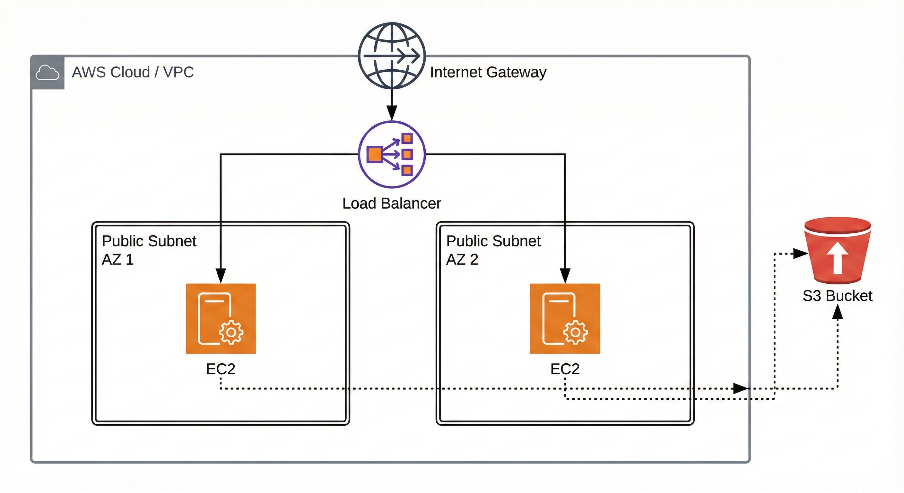

# 🚀 High Availability Web Infrastructure on AWS using Terraform


## 📖 Overview

This project automates the provisioning of a **High Availability (HA) Web Infrastructure** on AWS using **Terraform**. Instead of manual "Click-Ops," this project leverages **Infrastructure as Code (IaC)** to build a secure, scalable, and modular architecture.

It deploys web servers across multiple Availability Zones behind an Application Load Balancer, ensuring redundancy and fault tolerance. It also implements secure IAM roles for S3 access, avoiding the security risk of hardcoded credentials.

---

## 🏗️ Architecture




### Key Features:
*   **☁️ Custom Networking:** Built a VPC from scratch with Public Subnets across **2 Availability Zones** for high availability.
*   **⚖️ Load Balancing:** Configured an **Application Load Balancer (ALB)** to evenly distribute traffic to healthy instances.
*   **🔒 Security First:**
    *   **Security Groups** configured to allow traffic only on ports 80 (HTTP) and 22 (SSH).
    *   **IAM Roles & Instance Profiles** used for EC2 to access S3 (No hardcoded Access Keys on servers!).
*   **💻 Compute & Automation:**
    *   Deployed **Ubuntu EC2 instances**.
    *   Used **User Data scripts** (Bash) to auto-install Apache, AWS CLI, and deploy a custom webpage upon launch.
*   **📦 Modular Code:** The project is structured into reusable Terraform **Modules** (VPC, EC2, SG, IAM, ALB, S3).

---

## 📂 Project Structure

This project follows a modular directory structure for better maintainability:

```
.
├── main.tf                 # Root module calling all submodules
├── variables.tf            # Global variable definitions
├── outputs.tf              # Output values (ALB URL, etc.)
├── provider.tf             # AWS provider configuration
├── terraform.tfvars        # Variable values (create from example)
├── modules/
│   ├── vpc/                # Networking (VPC, Subnets, IGW, Route Tables)
│   ├── ec2/                # EC2 instances & Apache setup
│   ├── alb/                # Application Load Balancer & target groups
│   ├── iam/                # IAM roles & instance profiles
│   └── s3/                 # S3 bucket creation
└── README.md               # This file
```

---

## 📋 Prerequisites

Before deploying, ensure you have:

- **Terraform** v1.0+ installed
- **AWS CLI** v2 installed and configured (`aws configure`)
- **AWS Account** with appropriate permissions
- **SSH key pair** (`~/.ssh/id_rsa.pub` referenced in code)

---

## ⚡ Quick Start

```bash
# 1. Clone and navigate
git clone https://github.com/tayyab-cloud/automated-cloud-infrastructure-by-terraform.git
cd automated-cloud-infrastructure-by-terraform

# 2. Initialize Terraform
terraform init

# 3. Review and apply (update terraform.tfvars first)
terraform plan
terraform apply

# 4. Access your application via ALB DNS name
terraform output
```

---

## 👤 Author

**Tayyab Cloud**
- LinkedIn: [tayyab-cloud-automation](https://www.linkedin.com/in/tayyab-cloud-automation)
- GitHub: [@tayyab-cloud](https://github.com/tayyab-cloud)
